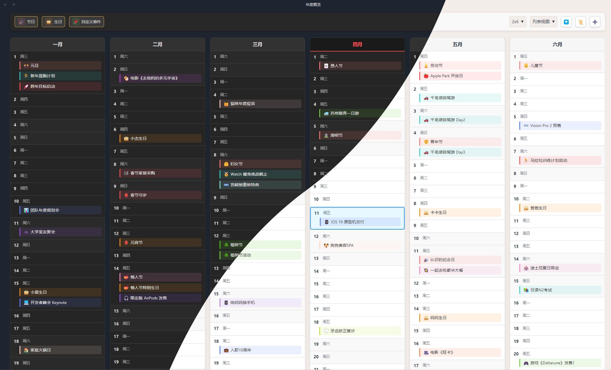

# Yearly Glance：时光不漏，一眼尽览

中文文档 | [English](./README.md)

---

> **Yearly Glance** 是一款 [Obsidian](https://obsidian.md/) 年度事件一览插件，帮助你高效规划、回顾和管理全年的重要日期，支持高度自定义和多种事件类型。

---

## 快捷目录
- [功能亮点](#功能亮点)
- [截图展示](#截图展示)
- [快速上手](#快速上手)
- [安装方法](#安装方法)

## 功能亮点

- 🗓️ **年度日历视图**：一屏尽览全年日历，年度规划一目了然
- 🎉 **多事件类型**：支持节日、生日、自定义事件等
- 🎂 **生日管理**：记录年龄、生肖、星座等属性
- 🎨 **高度可定制**：多种布局与配色风格，支持 emoji
- 🖱️ **交互界面**：点击即可查看和编辑事件
- 🔍 **事件筛选**：按类型过滤、隐藏空日期
- 🌙 **农历支持**：原生支持中国农历
- 🌏 **多语言**：支持简繁中文和英文语言

## 截图展示

**列表视图**

*灵活的事件列表管理界面*

**日历视图**

*经典日历布局，直观查看全年事件*

**事件过滤**

*按类型筛选，隐藏空日期，支持高亮显示重要事件*

**查看和编辑事件**

*便捷的事件编辑窗口*

## 快速上手

### 1. 打开年度概览
- 点击左侧边栏🔭望远镜图标
- 或使用命令面板搜索“打开年度概览”
- 或使用快捷键（如已设置）

### 2. 查看事件
- 不同颜色代表不同事件类型
- 点击事件查看详情
- 点击 🗂️ 管理按钮打开事件管理器查看所有事件

### 3. 添加事件
- 通过命令面板选择“管理事件”，点击右上角 ➕ 按钮添加
- 或者直接在概览视图中将鼠标移到指定日期，点击出现的 `+` 按钮
- 你也可以在命令面板中选择“添加事件”

### 4. 管理事件

- 通过命令面板打开事件管理器
- 在事件详情弹窗中点击 📍定位 按钮，将事件固定在事件管理器中
- 编辑：点击事件（在管理器或详情弹窗）中的 ✏️ 编辑 按钮，修改信息后保存
- 删除：点击事件（在管理器）中的 🗑️ 删除 按钮

*事件管理界面.*

## 自定义设置

在概览的顶部，有多个显示选项：

- 显示/隐藏节日、生日、自定义事件
- 切换到年度一览（推荐）、经典日历或自定义视图
- **仅限列表视图：**
  - 限制列表高度
  - 隐藏无事件的日期

更多设置可以在插件设置中查看。

## 安装方法

### 手动安装
1. 从 [最新发布页](https://github.com/Moyf/yearly-glance/releases/latest) 下载 `yearly-glance.zip`
2. 解压到你的 Obsidian 仓库的插件文件夹内： `<仓库路径>/.obsidian/plugins/yearly-glance/`
3. 重启 Obsidian 并在设置-社区插件中启用

### BRAT 安装（推荐体验新功能）
1. 安装 [BRAT](https://github.com/TfTHacker/obsidian42-brat) 插件
2. 在 BRAT 设置中“添加 Beta 插件”，输入 `Moyf/yearly-glance`
3. 启用插件

## 开发与贡献

1. 克隆本仓库
2. 确保 NodeJS 版本 ≥ 18 (`node --version`)
3. 安装依赖：`npm i` 或 `yarn`
4. 开启开发模式：`npm run dev`
5. 构建插件：`npm run build`
6. 构建并复制到你的 Obsidian 仓库（需要 `.env` 文件，包含 `VAULT_PATH=/path/to/your/vault`）：`npm run build:local`
7. 更新版本和更新清单：`npm run version`
8. 发布新版本：`npm run release`

---

## 支持与反馈

- 有问题或建议请 [提交 Issue](https://github.com/Moyf/yearly-glance/issues)
- 参与讨论：[Discussions](https://github.com/Moyf/yearly-glance/discussions)
- 欢迎 PR 贡献！详见 [CONTRIBUTING](./CONTRIBUTING.md) 文档

## 许可证

MIT License，详见 [LICENSE](./LICENSE)

## 星标历史

> 如果喜欢本插件，可以加个⭐️星星表示支持！