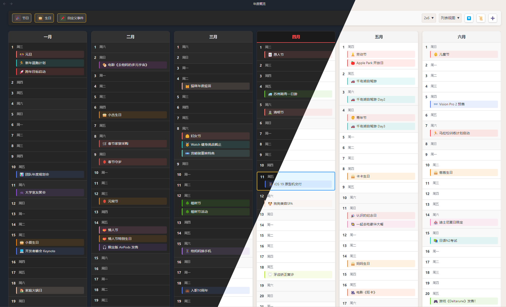

中文 | [English](./README.md)

# Yearly Glance：时光不漏，一眼尽览

Yearly Glance（年度一览）是一款 Obsidian 插件，用于提供可定制化管理的年度事件概览。

## 功能介绍

Yearly Glance 是一个 Obsidian 插件，提供全年事件的可视化概览，帮助您更好地规划和管理全年重要日期。主要功能包括：

- 📅 **年度日历视图**：直观展示全年所有月份的日历
- 🎉 **多种事件类型**：支持节日、生日和自定义事件
- 🎨 **高度可定制**：多种布局选项和显示风格
- 🔔 **事件提醒**：高亮显示重要日期
- 🖱️ **交互式界面**：悬停查看详细信息

## 使用指南

### 基本操作

1. **打开年度概览**：
   - 点击左侧边栏的日历图标
   - 使用命令面板（Ctrl+P）并搜索"打开年度概览"
   - 使用快捷键（如果已设置）

2. **查看事件**：
   - 在日历上，不同颜色表示不同类型的事件
   - 将鼠标悬停在有事件的日期上可查看详细信息
   - 日历下方的列表区域显示所有事件的完整信息

### 管理事件

1. **添加新事件**：
   - 在命令面板中选择"管理节日"、"管理生日"或"管理自定义事件"
   - 在弹出的模态框中点击"添加"按钮
   - 填写事件信息并保存

2. **编辑事件**：
   - 通过命令面板打开相应的事件管理器
   - 点击事件列表中的"编辑"按钮
   - 修改信息并保存

3. **删除事件**：
   - 在事件管理器中找到要删除的事件
   - 点击"删除"按钮

### 自定义设置

在 Obsidian 设置中找到"Yearly Glance"选项卡，可以调整以下设置：

- **基本设置**：
  - 年份选择
  - 标题自定义
  - 日历布局（网格、列表等）
  - 视图类型（月份、季度等）

- **显示选项**：
  - 显示/隐藏工作日
  - 高亮今天
  - 高亮周末
  - 显示图例
  - 限制列表高度
  - 事件字体大小
  - 显示提示
  - 彩色模式

- **事件显示**：
  - 显示/隐藏节日
  - 显示/隐藏生日
  - 显示/隐藏自定义事件
  - 周一作为一周的第一天

## 安装方法

### 手动安装

1. 下载最新版本
2. 将 `main.js`、`styles.css` 和 `manifest.json` 复制到您的 vault 插件文件夹：`<vault>/.obsidian/plugins/yearly-glance/`
3. 重新加载 Obsidian
4. 在设置 → 社区插件中启用该插件

### BRAT 安装（推荐 Beta 用户使用）

1. 安装 [BRAT](https://github.com/TfTHacker/obsidian42-brat) 插件
2. 在 BRAT 设置中点击"添加 Beta 插件"
3. 输入 `Moyf/yearly-glance`
4. 启用插件

## 开发指南

- 克隆此仓库
- 确保您的 NodeJS 版本至少为 v18（`node --version`）
- 运行 `npm i` 或 `yarn` 安装依赖
- 运行 `npm run dev` 以监视模式启动编译
- 运行 `npm run build` 构建插件
- 运行 `npm run build:local` 构建插件并将其复制到您的 vault 插件文件夹（需要在项目根目录创建一个 `.env` 文件并添加：`VAULT_PATH=/path/to/your/vault`）
- 运行 `npm run version` 更新版本号并更新 manifest.json、version.json、package.json
- 运行 `npm run release` 构建插件并更新版本号

## 支持与帮助

如果您遇到任何问题或有建议：
- 在 GitHub 上[提交问题](https://github.com/Moyf/yearly-glance/issues)
- [加入讨论](https://github.com/Moyf/yearly-glance/discussions)提出问题和想法

## 许可证

本项目采用 MIT 许可证 - 详情请参阅 [LICENSE](LICENSE) 文件。 

## 星标历史

