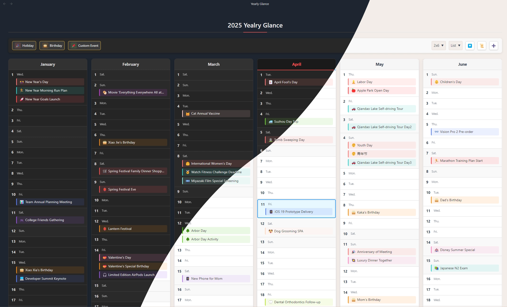
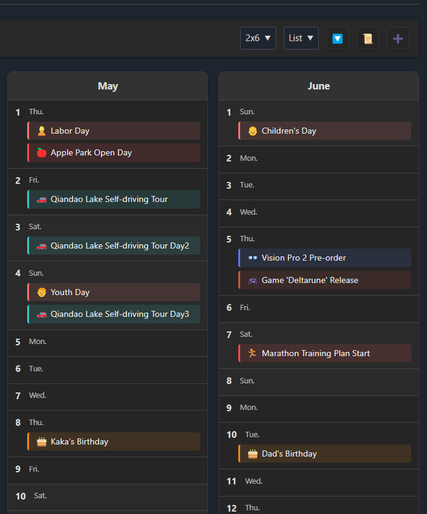
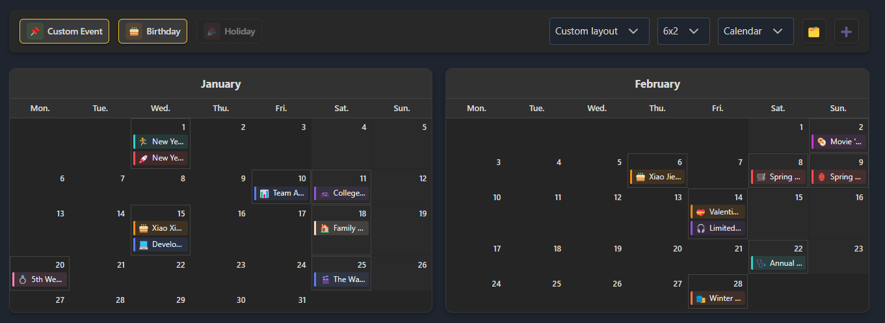
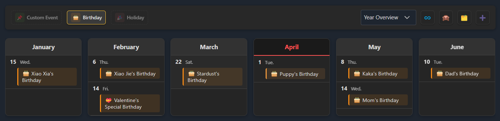
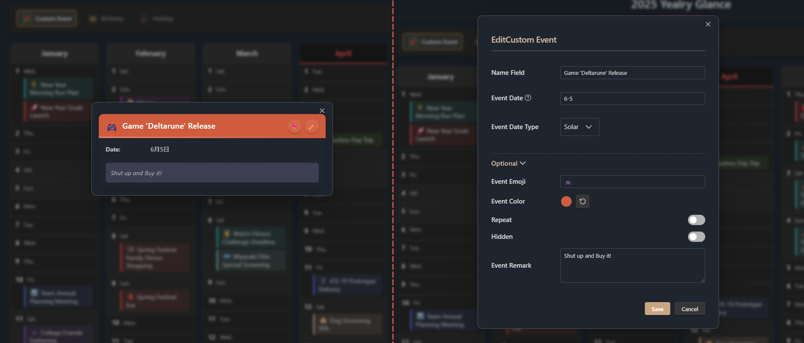
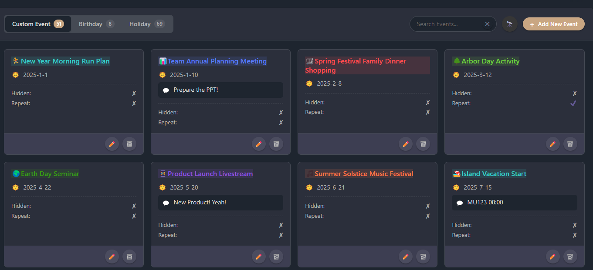
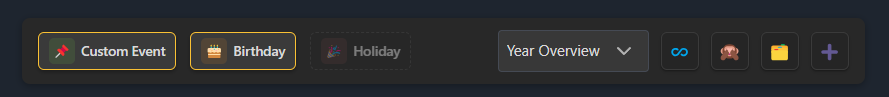
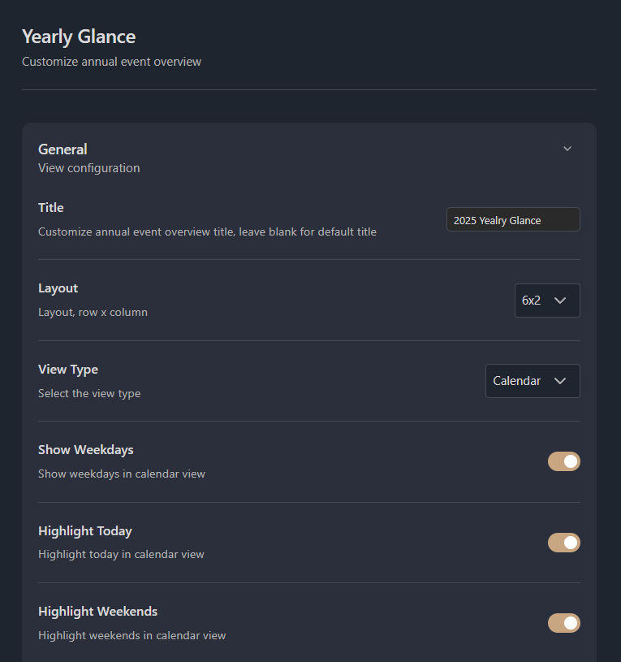

# Yearly Glance - All the moments, at a glance

English | [中文文档](./README-zh.md)

---

> **Yearly Glance** is an [Obsidian](https://obsidian.md/) plugin that provides a visual and customizable overview of annual events, helping you efficiently plan, review, and manage important dates throughout the year.

---

## Table of Contents
- [Features](#features)
- [Screenshots](#screenshots)
- [Getting Started](#getting-started)
- [Installation](#installation)

## Features

- 🗓️ **Yearly Calendar View**: See all months and days of the year at a glance, making annual planning effortless.
- 🎉 **Multiple Event Types**: Supports holidays, birthdays, and fully customizable events.
- 🎂 **Birthday Management**: Track birthdays with age, zodiac, and other attributes.
- 🎨 **Highly Customizable**: Choose from various layouts and display styles; personalize with custom colors and emojis.
- 🖱️ **Interactive Interface**: Click any event to view details or edit quickly.
- 🔍 **Event Filtering**: Filter by event type and hide empty dates for a cleaner view.
- 🌙 **Lunar Calendar Support**: Natively supports the traditional Chinese lunar calendar.
- 🌏 **Multi-language Support**: English and Chinese (Both simplified and traditional) available.

## Screenshots

**Customizable List View**

*Display and manage events in a flexible list format.*

**Classic Calendar View**

*Traditional calendar layout for intuitive navigation.*

**Event Filtering**

*Filter by event type and hide dates with no events.*

**View & Edit Event Details**

*Quickly view and edit event details in a modal.*

## Getting Started

### 1. Open Yearly Glance
- Click the 🔭 telescope icon in the left sidebar
- Or use the command palette (Ctrl+P) to search for "Open Yearly Glance"
- Or use keyboard shortcuts (if configured)

### 2. View Events
- Different colors represent different event types on the calendar
- Click an event to see details
- Click the 🗂️ Manage button to open the Events Manager and view all events

### 3. Add Events
- Open the Events Manager via the command palette and click the ➕ Add button
- Or, hover over a date and click the `+` button
- Or, select "Add Event" in the command palette

### 4. Manage Events

- Open the Events Manager from the command palette
- Pin events from the details modal to locate them in the Events Manager
- Edit: Click the ✏️ Edit button on an event (in manager or detail modal), modify info and save
- Delete: Click the 🗑️ Trash button on an event in the Events Manager

*Centralized event management interface.*

## Customization Settings

At the top of the overview, there are several display options:

- Show/hide holidays, birthdays, and custom events
- Switch between Yearly Overview (recommended), Classic Calendar, or Custom View
- **List View only:**
  - Limit the list height
  - Hide dates with no events

More settings are available in the plugin settings within Obsidian.

## Installation

### Manual Installation
1. Download the `yearly-glance.zip` from the [latest release](https://github.com/Moyf/yearly-glance/releases/latest)
2. Unzip it to your vault's plugins folder: `<your-vault>/.obsidian/plugins/yearly-glance/`
   - *Tip: You can find your vault path in Obsidian's vault settings.*
3. Reload Obsidian
4. Enable **Yearly Glance** in Settings → Community Plugins

### BRAT (Recommended for Beta Users)
1. Install the [BRAT](https://github.com/TfTHacker/obsidian42-brat) plugin
2. Click "Add Beta plugin" in BRAT settings
3. Enter `Moyf/yearly-glance`
4. Enable the plugin

## Development

1. Clone this repo
2. Ensure NodeJS version is at least v18 (`node --version`)
3. Install dependencies: `npm i` or `yarn`
4. Start compilation in watch mode: `npm run dev`
5. Build the plugin: `npm run build`
6. Build and copy to your vault (requires `.env` file in project root with `VAULT_PATH=/path/to/your/vault`): `npm run build:local`
7. Bump version and update manifests: `npm run version`
8. Release new version: `npm run release`

---

## Support

If you encounter any issues or have suggestions:
- [Open an issue](https://github.com/Moyf/yearly-glance/issues) on GitHub
- [Join the discussion](https://github.com/Moyf/yearly-glance/discussions) for questions and ideas
- Contributions are welcome! See [CONTRIBUTING](./CONTRIBUTING.md) for details.

## License

This project is licensed under the MIT License. See the [LICENSE](LICENSE) file for details.

## Star History

> If you like this plugin, please consider star it! 🌟